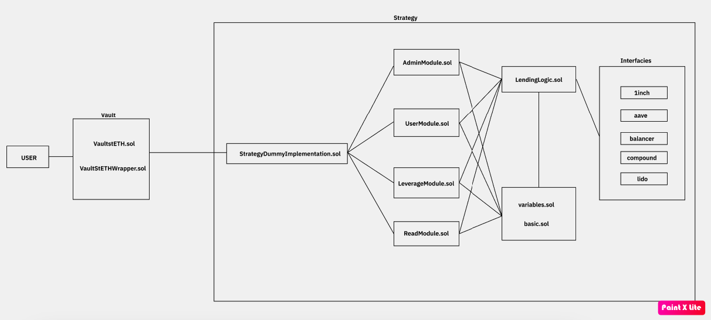

## Recursive staking

This smart contract is largely composed of Vault, Strategy, LendingLogic contracts. Vault is upgradeable ERC4626 contract and Strategy used transparenty pattern for implementing complex logic.

Vault is purposed to provide users with a gateway for depositing and withdrawing funds and to manage user shares. 

LendingLogic contract encompasses all the content related to strategy pools and lending operations involved.

Strategy consists of:
-   **AdminModule**: This module includes various functionalities for managing permissions, appointments, and parameter adjustments. It allows for the management and adjustment of permissions and parameters within the strategy pool, includingthe ability to appoint and dismiss administrators, adjust settings, and modify parameters as needed.
-   **UserModule**: This module controls the flow of funds between the strategy contract and the vault contract when users deposit or withdraw funds.
-   **ReadModule**: This is the basic module includes basic functionalities for using all contracts.
-   **LeverageModule**: This is the core logic contracts for implementing recursive borrow/lending using flashloan.

## Smart Contract Architecture


### Build

```shell
$ forge build
```

### Test

```shell
$ forge test
```

### Anvil

```shell
$ anvil
```

### Deploy

```shell
$ forge script DeployVault -s "vaultDeployTestnet()" --force --broadcast --verify
```

### Cast

```shell
$ cast <subcommand>
```
